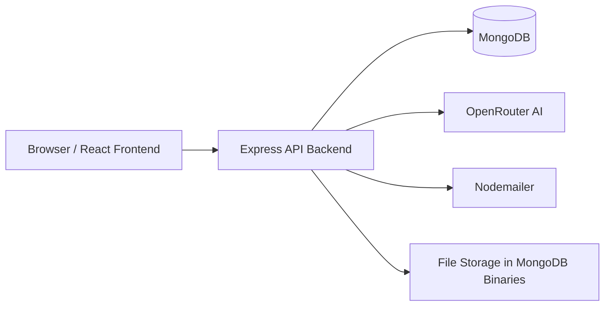

# Innovative Science 2

Innovative Science 2 is a full-stack science learning platform built for Class 10 students. It combines chapter browsing, objective practice, custom tests, progress tracking, leaderboards, class boards, feedback tools, and admin management in one place.

The app is designed to help students move from reading to practice to measurable improvement. It also gives teachers and admins the tools to manage content, class groups, notices, student reports, and shared study material.

## What This Project Does

This platform lets a student:

- Explore science chapters and topics.
- Open objective practice sets for different question formats.
- Take mixed custom tests.
- Review scores, weak areas, and improvement data.
- Compare progress on a global or class leaderboard.
- Read previous year question papers.
- Submit feedback, reports, and contact requests.
- Chat with the AI Teacher for simple explanations.

It also lets an admin:

- Manage chapters, topics, objective types, and questions.
- Publish site notices and class board updates.
- Create and manage classes and student assignments.
- Review reports, feedback, contacts, and messages.
- Upload PYQs and class resources.
- Track student performance and leaderboard activity.

## Roles

| Role | What they can do |
| --- | --- |
| Guest | Browse public pages such as the homepage, chapters, leaderboard, PYQs, contact, and feedback. Guests can read content but cannot save progress or use authenticated tools. |
| Student | Sign in, practice questions, take tests, view personal progress, join a class, use AI Teacher, and access their profile and improvement dashboards. |
| Admin | Use the admin dashboard to manage content, students, classes, notices, reports, feedback, contacts, PYQs, and class board posts. |

## Main Features

### Learning and Practice

- Chapter-wise browsing.
- Topic-wise learning.
- Objective practice types:
  - MCQs
  - True or False
  - Correlation
  - Match the Following
  - Complete the Tables
  - Diagram Based Questions
  - Identify Symbol
- Chapter weightage view for revision planning.
- Previous year question papers.
- Custom test builder for mixed practice.

### Progress and Motivation

- Saved practice attempts.
- Score and percentage tracking.
- Brain cells rewards.
- Weak area and improvement tracking.
- Global leaderboard.
- Class leaderboard.
- Rank notifier and progress popups.
- Featured student feedback on the homepage.

### Communication and Support

- Contact form.
- Student feedback collection.
- Question report submission.
- Admin announcements/site notices.
- Student messages and acknowledgements.
- AI Teacher chat for simple explanations and app help.

### Admin Management

- Admin dashboard overview.
- Student search and filtering.
- Class creation and editing.
- Student-to-class assignment.
- Objective content management.
- Question creation, editing, deletion, and AI drafting.
- Feedback moderation.
- Report review and resolution.
- Contact request inbox.
- PYQ management.
- Class board post publishing with text, photos, and PDFs.

## How To Use

### For Students

1. Open the homepage.
2. Sign up or sign in.
3. Browse `Chapters` to choose a chapter and topic.
4. Open an objective type to start practice.
5. Answer the questions and submit your work.
6. Review your score, brain cells, and improvement data.
7. Use `Test Builder` to create a custom test if you want mixed practice.
8. Check `Leaderboard` to compare progress with other students.
9. Open `Profile` to view your account and progress summary.
10. Use `Feedback`, `Contact`, or `Reports` whenever you want to share input or flag an issue.

### For Admins

1. Sign in with an admin account.
2. Open the `Admin` dashboard.
3. Review student counts, class counts, reports, and feedback.
4. Manage chapters, topics, objective types, and questions.
5. Create or update classes and assign students.
6. Publish site notices or class board updates.
7. Review and resolve reports, contacts, and feedback.
8. Upload or remove PYQs and supporting documents.

## Step By Step Flow

### Student Flow

1. The app loads the homepage and fetches public content such as chapters, leaderboard data, featured feedback, and site notices.
2. The student signs in or signs up.
3. Authentication is stored locally for a limited time so the user stays signed in across refreshes.
4. The student navigates through chapters, then topics, then an objective type.
5. The practice page loads the questions for that objective type.
6. The student answers and submits.
7. The backend stores the attempt, updates totals, updates leaderboard-related values, and records improvement data.
8. The UI shows progress on the homepage, profile page, improvement page, and leaderboard.

### Test Builder Flow

1. A signed-in user opens `Test Builder`.
2. The app checks authentication before allowing access.
3. The user chooses chapters and question types.
4. The backend generates a test with the selected scope.
5. The student completes the test and submits it.
6. The backend stores the result and updates performance data.

### Admin Flow

1. An admin signs in.
2. The admin opens the dashboard.
3. The dashboard loads student, class, report, feedback, and contact data.
4. The admin can edit academic structure, review content, and post notices.
5. Admin changes are reflected in the student experience immediately after the next fetch or refresh.

## Architecture

The project uses a classic three-layer architecture:



### Frontend

- Built with React 19 and Vite.
- Uses `HashRouter` for client-side routing.
- Uses `framer-motion` for transitions and polished UI behavior.
- Uses `lucide-react` icons and Tailwind CSS v4 styling.
- Stores authentication in browser `localStorage`.
- Calls the backend through a small API helper in `frontend/src/api.js`.

### Backend

- Built with Node.js and Express.
- Uses MongoDB through Mongoose models.
- Handles authentication with JWT.
- Uses `bcryptjs` for password hashing and verification.
- Uses `multer` for uploads.
- Uses `sharp` for image processing.
- Uses `compression` and `cors`.
- Integrates with OpenRouter for AI responses and AI drafting features.

### Data And State

- User accounts, classes, chapters, topics, objective types, questions, tests, feedback, reports, notices, contacts, PYQs, messages, and class board posts are persisted in MongoDB.
- Progress data is computed from practice attempts and test submissions.
- Leaderboard totals are derived from stored practice history.

## Main Pages

- `Home` - hero section, leaderboard preview, chapter weightage preview, featured feedback, progress summary, and AI Teacher.
- `About` - project and platform overview.
- `Chapters` - chapter browsing.
- `Topics` - topic listing within a chapter.
- `Objectives` - objective type selection within a topic.
- `Practice Pages` - MCQs, true/false, correlation, match the following, complete the tables, diagram-based questions, and identify symbol.
- `PYQs` - previous year question papers.
- `Leaderboard` - global and class performance ranking.
- `Improvement` - personal performance and weak area tracking.
- `Profile` - user account and progress details.
- `Contact` - support/contact form.
- `Feedback` - ratings and feedback submission.
- `Test Builder` - custom test creation for signed-in users.
- `Admin` - management console for admin users.
- `Class` - class board and class-specific content.

## API Overview

The backend exposes REST endpoints under `/api`.

### Public And Auth APIs

- `POST /api/auth/signup`
- `POST /api/auth/signin`
- `POST /api/auth/forgot-password/reset`
- `GET /api/auth/me`
- `PATCH /api/auth/profile`
- `PATCH /api/auth/update-email`
- `PATCH /api/auth/update-password`
- `POST /api/auth/profile-image`

### Content And Practice APIs

- `GET /api/chapters`
- `GET /api/chapters/:chapterNumber/topics`
- `GET /api/topics/:id/objective-types`
- `GET /api/topics/:topicId/objective-types/:type/practice`
- `POST /api/objective-types/:id/done`
- `POST /api/objective-types/:id/submit`
- `POST /api/tests/generate`
- `POST /api/tests/submit`

### Progress And Social APIs

- `GET /api/progress/me`
- `GET /api/progress/improvement`
- `GET /api/leaderboard`
- `GET /api/leaderboard/me`
- `GET /api/classes`
- `GET /api/classes/:classId/feed`
- `POST /api/reports`
- `POST /api/feedback`
- `GET /api/feedback/featured`
- `GET /api/messages/me`

### Admin APIs

- `GET /api/admin/dashboard`
- `GET /api/admin/students`
- `GET /api/admin/classes`
- `GET /api/admin/reports`
- `GET /api/admin/contacts`
- `GET /api/admin/feedback`
- `GET /api/admin/announcement`
- `POST /api/admin/announcement`
- `POST /api/admin/messages`
- `POST /api/admin/pyqs`
- `POST /api/admin/classes`
- `PATCH /api/admin/classes/:id`
- `DELETE /api/admin/classes/:id`

### AI APIs

- `POST /api/ai/tutor`
- `POST /api/objective-types/:id/questions/ai-draft`

## Benefits

- Students get a clear path from chapter study to practice to measurable improvement.
- Practice is broken into small objective formats, which makes revision easier.
- The leaderboard adds healthy competition and visible motivation.
- The improvement page helps students focus on weak topics instead of repeating everything.
- Admins can manage content and communication from one dashboard.
- AI Teacher gives quick, simple explanations without leaving the app.
- The app works as a single platform for study, testing, notices, and feedback.

## Technology Stack

### Frontend

- React 19
- React Router DOM
- Vite
- Tailwind CSS 4
- Framer Motion
- Lucide React

### Backend

- Node.js
- Express
- MongoDB / Mongoose
- JWT
- bcryptjs
- multer
- sharp
- nodemailer
- cors
- compression
- OpenRouter API for AI features

## Project Structure

```text
Innovative_science_2/
  backend/
    server.js
    package.json
    .env
  frontend/
    src/
      App.jsx
      api.js
      authStorage.js
      components/
      pages/
    public/
    package.json
    .env
  render.yaml
  README.md
```

## Setup

### Prerequisites

- Node.js 18 or later.
- MongoDB database.
- OpenRouter API key if you want the AI features.

### Frontend Environment

The frontend reads `frontend/.env`.

```env
VITE_API_URL=http://localhost:5000
VITE_CHAPTER_WEIGHTAGE_PREVIEW_MS=5000
```

### Backend Environment

Create `backend/.env` with values like:

```env
PORT=5000
MONGODB_URI=your_mongodb_connection_string
JWT_SECRET=your_secret_key
CLIENT_URL=http://localhost:5173
OPENROUTER_API_KEY=your_openrouter_key
OPENROUTER_MODEL=google/gemini-2.5-flash-lite
MAX_COMPLETION_TOKENS=1800
CLASS_POST_PHOTO_FORMAT=webp
```

`CLIENT_URL` can be a comma-separated list of allowed origins if you need more than one frontend URL.

## Local Development

### 1. Start the backend

```bash
cd backend
npm install
npm run dev
```

### 2. Start the frontend

```bash
cd frontend
npm install
npm run dev
```

### 3. Open the app

- Frontend: `http://localhost:5173`
- Backend: `http://localhost:5000`

## Production Build

### Frontend build

```bash
cd frontend
npm run build
```

### Backend start

```bash
cd backend
npm start
```

The backend serves the built frontend from `frontend/dist` when the build exists.

## Deployment Notes

- The repository includes `render.yaml` for Render deployment.
- The backend build process is configured to install and build the frontend before start-up.
- Because the app uses hash-based routing, direct page reloads are safe in production without a custom rewrite rule for every route.
- Make sure MongoDB and OpenRouter credentials are available in the deployment environment.

## Important Behavior Notes

- Authentication is stored in browser local storage and expires after 7 days.
- Guests can browse public content, but sensitive tools are gated behind sign-in.
- The app fetches site notices periodically and displays them outside objective practice screens.
- The homepage includes an AI Teacher widget that sends questions to the backend AI endpoint.
- Some admin and test-builder screens are protected and redirect or show a sign-in prompt if the user is not authenticated.

## Suggested Next Steps

If you want, I can also:

1. Add a shorter `frontend/README.md` that points to this root README.
2. Add a polished badge section and screenshots placeholder.
3. Generate a quick `README` table of contents for easier navigation.
